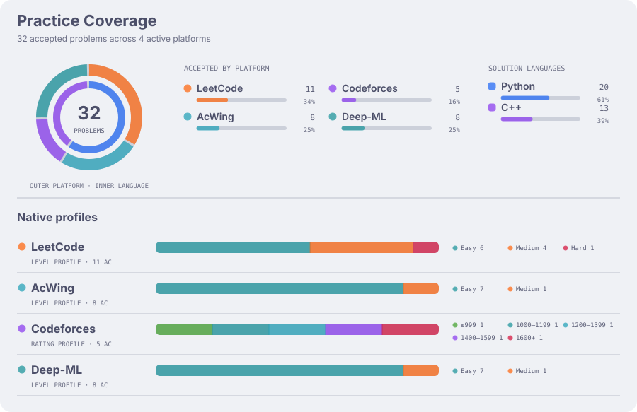
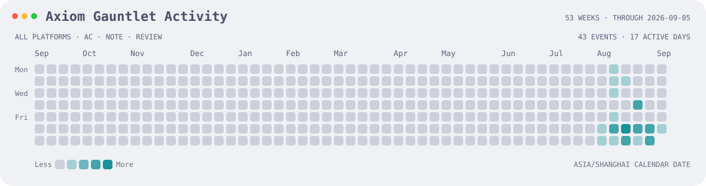

# Axiom Gauntlet

[English](README.md) | [简体中文](README_zh-CN.md)

> **Nightglass Protocol** 的算法试炼场。

一个用于保持思维与代码能力的轻量算法练习仓库。`problems/` 保存 Accepted 解答和平台确认
证据，`knowledge/` 将多道题共享的推理沉淀为可复用的双语知识。

## 最近完成

<!-- recent-problems:start -->

| 日期 | 题目 | 平台 | 语言 |
| --- | --- | --- | --- |
| 2026-08-09 | [String Task](problems/codeforces/118A/) | Codeforces | Python |
| 2026-08-09 | [Transpose of a Matrix](problems/deep-ml/2/) | Deep-ML | Python |
| 2026-08-08 | [归并排序](problems/acwing/787/) | AcWing | C++ |
| 2026-08-08 | [Way Too Long Words](problems/codeforces/71A/) | Codeforces | C++ |
| 2026-08-08 | [Matrix times Vector](problems/deep-ml/1/) | Deep-ML | Python |

<!-- recent-problems:end -->

## 覆盖情况

## 活动

总计活动热力图汇总所有已支持平台记录的题目事件，而不是统计 Git commit。

## 知识

浏览双语[知识索引](knowledge/INDEX_zh-CN.md)。仓库结构和元数据契约见
[Schema](docs/SCHEMA_zh-CN.md)。
