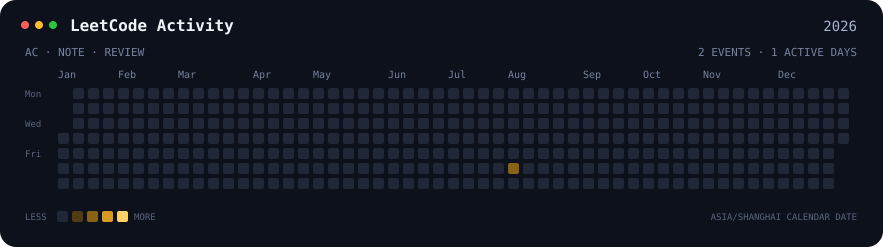
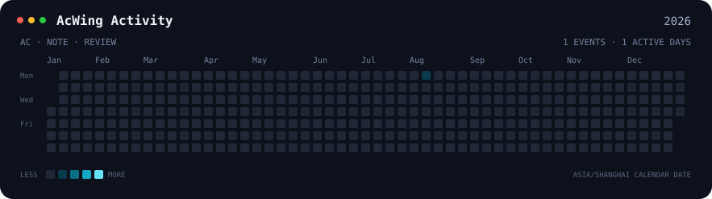
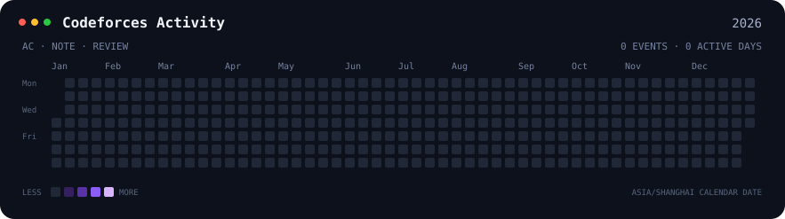

# Axiom Gauntlet

[English](README.md) | [简体中文](README_zh-CN.md)

> **Nightglass Protocol** 的算法试炼场。

Axiom Gauntlet 把日常解题证据与可复用知识分开：Accepted 代码和平台确认结果保存在
`problems/`，延迟复盘再把多道题共享的推理沉淀到 `knowledge/` 双语知识库。

## 工作流

创建草稿时不复制完整题面：

```bash
uv sync --locked --all-groups
uv run axiom new leetcode 1 \
  --title "Two Sum" \
  --url "https://leetcode.com/problems/two-sum/" \
  --difficulty easy \
  --language cpp
```

只有在线评测平台明确返回 Accepted 后，才记录实际通过的语言及其复杂度：

```bash
uv run axiom accept leetcode 1 \
  --language cpp \
  --date 2026-08-01 \
  --time-complexity "O(n)" \
  --space-complexity "O(n)"
```

延迟复盘时，把相似题归入规范知识主题，不在每道题旁重复同一份教程：

```bash
uv run axiom knowledge new dynamic-programming/interval-dp \
  --title "Interval DP" \
  --title-zh-cn "区间动态规划" \
  --tag dynamic-programming
```

完成生成的中英文知识笔记后，再记录生命周期并生成索引：

```bash
uv run axiom knowledge document dynamic-programming/interval-dp --date 2026-08-02
uv run axiom knowledge render
```

`axiom-practice` 负责日常解题、AC 记录、复杂度和代码 Review；`axiom-review` 负责周度
归纳、知识页维护和确实有帮助的图解。

当前契约见[题目与知识 Schema](docs/SCHEMA_zh-CN.md)、
[知识笔记架构](docs/KNOWLEDGE_ARCHITECTURE_zh-CN.md)和
[知识笔记写作规范](docs/STYLE_GUIDE_zh-CN.md)。使用 `make verify` 运行完整本地门禁。

## 活动

题目活动热力图根据 `problem.toml` 事件生成，而不是统计 Git commit；知识维护使用独立生成的
[`LOG.md`](knowledge/LOG.md)。







## 持续集成

Pull Request 会运行完整验证门禁，并检查热力图与知识索引是否为最新版本。
